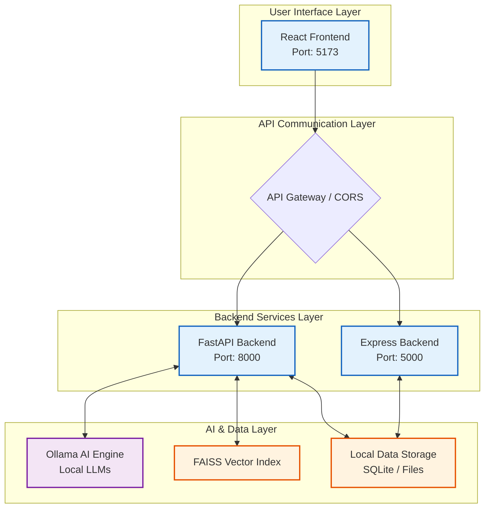
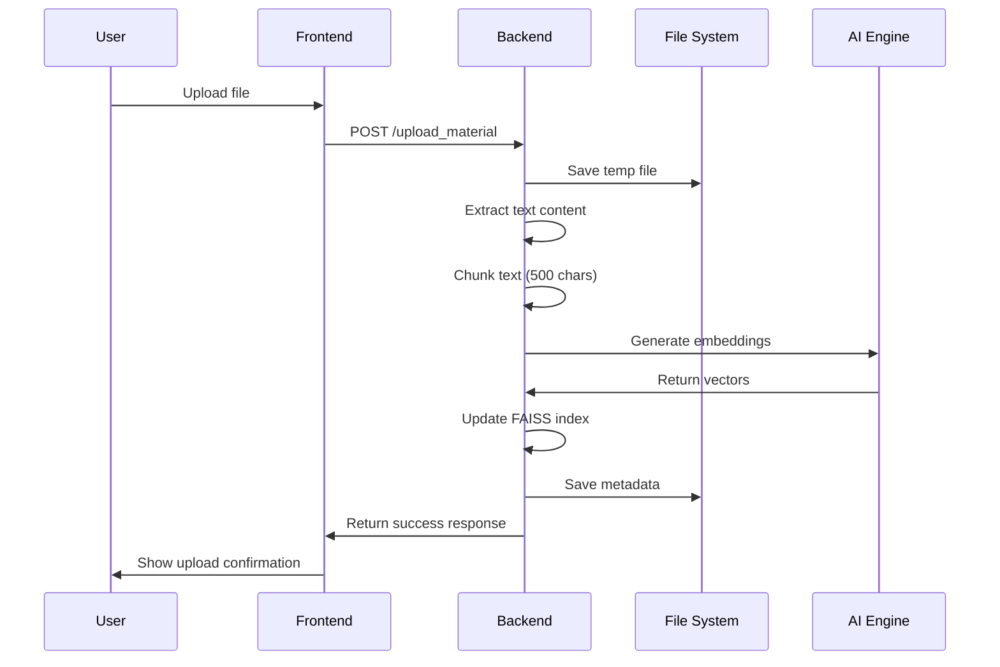
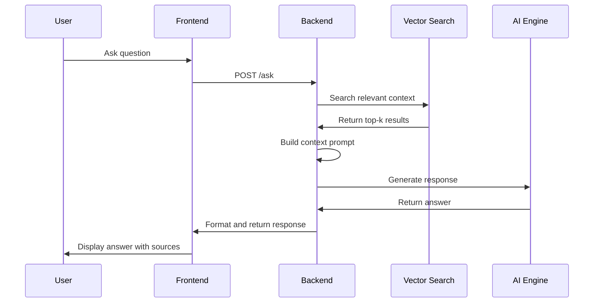
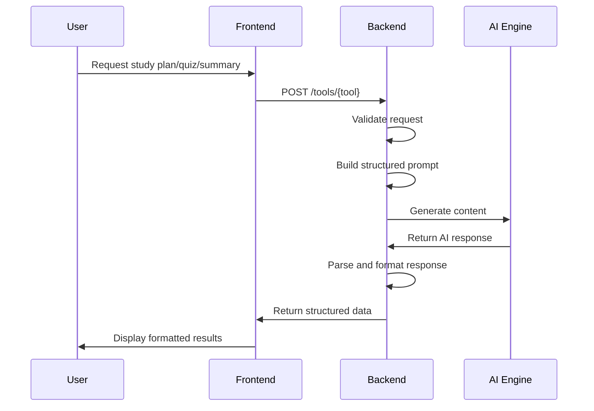

# Dabba AI - Architecture Guide

## System Architecture Overview

Dabba AI is a full-stack educational AI application built with a modern, scalable architecture that emphasizes local-first processing, privacy, and performance. The system consists of multiple layers working together to provide AI-powered study tools.



## Component Architecture

### Frontend Architecture

#### React Application Structure

```
frontend/src/
├── App.jsx                 # Main application component
├── components/             # Reusable UI components
│   ├── Chat.jsx           # Chat interface
│   ├── StudyPlanner.jsx   # Study planning tool
│   ├── QuizGenerator.jsx  # Quiz creation tool
│   ├── NoteSummarizer.jsx # Text summarization
│   ├── FileUpload.jsx     # Document upload interface
│   └── ...
├── assets/                # Static assets (images, icons)
├── App.css               # Main styles
└── main.jsx              # Application entry point
```

#### State Management

- **Local State**: React useState/useContext for component-level state
- **Session Storage**: Browser localStorage for chat history and preferences
- **Server State**: RESTful API communication for data persistence

#### UI Framework

- **React 19**: Modern React with concurrent features
- **Vite**: Fast build tool and development server
- **TailwindCSS**: Utility-first CSS framework
- **Responsive Design**: Mobile-first approach with breakpoints

### Backend Architecture

#### FastAPI Backend (Primary)

**File Structure:**

```
backend/
├── main.py                    # FastAPI application
├── ollama_utils.py           # Ollama AI integration
├── embedding_manager.py      # FAISS vector search
├── file_utils.py             # File processing utilities
├── requirements.txt          # Python dependencies
└── config/                   # Configuration files
```

**Key Components:**

1. **FastAPI Application (`main.py`)**

   - REST API endpoints
   - Request/response handling
   - Middleware configuration
   - Error handling
2. **Ollama Integration (`ollama_utils.py`)**

   - AI model communication
   - Prompt engineering
   - Response processing
   - Model management
3. **Vector Search (`embedding_manager.py`)**

   - Document embedding generation
   - FAISS index management
   - Similarity search operations
   - Metadata tracking
4. **File Processing (`file_utils.py`)**

   - PDF/TXT parsing
   - Text chunking
   - Content extraction
   - File validation

#### Express.js Backend (Secondary)

**Intended Structure:**

```
backend/
├── server.js                 # Express application
├── config/
│   └── db.js                # MongoDB connection
└── routes/                  # API route handlers
    ├── aiRoutes.js          # AI service routes
    ├── studyPlannerRoutes.js # Study planning
    ├── flashcardRoutes.js   # Flashcard management
    ├── quizRoutes.js        # Quiz operations
    ├── lessonRoutes.js      # Lesson planning
    └── progressRoutes.js    # Progress tracking
```

**Note**: The Express.js backend appears to be a planned/placeholder implementation. Current functionality is primarily handled by the FastAPI backend.

## AI Integration Architecture

### Ollama AI Engine

#### Model Management

```python
# Ollama Integration Pattern
class OllamaManager:
    def __init__(self):
        self._available_models = []
        self._cache_timeout = 30

    def run_ollama(self, prompt: str, model: str = "gemma3:1b") -> str:
        # Execute AI model with prompt
        # Handle retries and errors
        # Return generated response

    def get_available_models(self) -> List[ModelInfo]:
        # Fetch available models from Ollama
        # Cache results for performance
        # Return model information

    def test_model(self, model: str) -> Dict:
        # Test model availability
        # Validate model performance
        # Return test results
```

#### Prompt Engineering

The system uses structured prompts to ensure consistent, high-quality AI responses:

```python
# Example Study Plan Prompt Structure
prompt = f"""
Create a detailed {difficulty} level study plan for {subject}.
Duration: {duration} weeks
Goals: {goals}

Please provide a structured study plan with:
- Weekly breakdown of topics
- Daily study schedule recommendations
- Recommended resources and materials
- Assessment methods and checkpoints
- Study tips and best practices

Format the response in a clear, organized manner.
"""
```

### Vector Search Architecture

#### Embedding Pipeline

1. **Document Ingestion**

   - File upload and validation
   - Text extraction (PDF/TXT)
   - Content chunking for optimal search
2. **Embedding Generation**

   - Sentence-Transformers model (`all-MiniLM-L6-v2`)
   - Vector representation creation
   - Batch processing for efficiency
3. **Index Management**

   - FAISS index creation and updates
   - Metadata tracking and storage
   - Incremental index updates

#### Search Process

```python
# Search Implementation Pattern
def search(self, query: str, top_k: int = 3) -> List[Dict]:
    # Generate query embedding
    query_embedding = self.model.encode([query])

    # Perform similarity search
    scores, indices = self.index.search(query_embedding, top_k)

    # Retrieve relevant chunks and metadata
    results = []
    for score, idx in zip(scores[0], indices[0]):
        if idx != -1:  # Valid result
            result = {
                'text': self.chunks[idx],
                'score': float(score),
                'metadata': self.metadata[idx]
            }
            results.append(result)

    return results
```

## 💾 Data Storage Architecture

### Data Organization

```
data/
├── index.faiss           # FAISS vector index
├── materials.pkl         # Document metadata
└── embeddings.db         # Embeddings database
```

### Storage Types

1. **Vector Index (FAISS)**

   - Efficient similarity search
   - Compressed storage format
   - Memory-mapped for performance
2. **Metadata Storage (Pickle)**

   - Document information
   - Chunk mapping
   - Source attribution
3. **Embeddings Database**

   - Raw vector storage
   - Backup and recovery
   - Analysis and debugging

### Session Management

- **Browser Storage**: localStorage for chat history
- **Server State**: In-memory session handling
- **Optional MongoDB**: Persistent session storage (planned)

## Data Flow Architecture

### File Upload Flow



### Question-Answering Flow



### AI Tool Generation Flow



## 🔒 Security Architecture

### Current Security Measures

1. **Input Validation**

   - File type restrictions (PDF/TXT only)
   - Input sanitization
   - Request size limits
2. **CORS Configuration**

   - Development: Open CORS for local development
   - Production: Configurable origin restrictions
3. **Error Handling**

   - Secure error messages (no sensitive data exposure)
   - Proper HTTP status codes
   - Request logging without sensitive information

### Privacy-First Design

- **Local Processing**: All AI inference happens locally
- **No External APIs**: Data never leaves the user's machine
- **Optional Cloud Storage**: MongoDB integration is optional

### Production Security Recommendations

1. **Authentication & Authorization**

   - JWT-based authentication
   - Role-based access control
   - API key management
2. **Network Security**

   - HTTPS enforcement
   - Rate limiting
   - DDoS protection
3. **Data Protection**

   - Encrypted database connections
   - Secure file handling
   - Input validation and sanitization

## Performance Architecture

### Optimization Strategies

1. **AI Model Optimization**

   - Model quantization support
   - Efficient prompt engineering
   - Response caching mechanisms
2. **Vector Search Performance**

   - Index optimization
   - Batch processing
   - Memory management
3. **Frontend Performance**

   - Code splitting
   - Lazy loading
   - Service worker caching

### Scalability Considerations

1. **Horizontal Scaling**

   - Stateless backend design
   - Load balancer compatibility
   - Database clustering support
2. **Resource Management**

   - Memory usage monitoring
   - Model loading optimization
   - File upload limits

## Configuration Architecture

### Environment-Based Configuration

```python
# Backend Configuration
class Config:
    OLLAMA_URL = os.getenv("OLLAMA_URL", "http://localhost:11434")
    MONGODB_URL = os.getenv("MONGODB_URL")
    FAISS_INDEX_PATH = os.getenv("FAISS_INDEX_PATH", "../data/index.faiss")
    EMBEDDINGS_MODEL = os.getenv("EMBEDDINGS_MODEL", "all-MiniLM-L6-v2")
    DEBUG = os.getenv("DEBUG", "false").lower() == "true"
```

### Model Configuration

- **Default Model**: `gemma3:1b` (lightweight, fast)
- **Embedding Model**: `all-MiniLM-L6-v2` (balanced performance)
- **Alternative Models**: Support for llama2, codellama, etc.

## Testing Architecture

### Testing Strategy

1. **Unit Tests**

   - Individual component testing
   - Mock external dependencies (Ollama)
   - FastAPI endpoint testing
2. **Integration Tests**

   - Full request/response cycles
   - Database interaction testing
   - File processing validation
3. **End-to-End Tests**

   - Complete user workflows
   - Frontend-backend integration
   - AI tool functionality

### Test Structure

```
tests/
├── unit/
│   ├── test_ollama_utils.py
│   ├── test_embedding_manager.py
│   └── test_file_utils.py
├── integration/
│   ├── test_api_endpoints.py
│   └── test_ai_tools.py
└── e2e/
    ├── test_user_workflows.py
    └── test_file_upload.py
```

## Monitoring & Observability

### Logging Architecture

1. **Structured Logging**

   - JSON format for machine parsing
   - Consistent log levels
   - Contextual information
2. **Log Categories**

   - Application events
   - AI model interactions
   - Error conditions
   - Performance metrics

### Health Checks

- **Backend Health**: `/health` endpoint
- **Ollama Status**: `/tools/test` endpoint
- **Model Availability**: `/ollama/status` endpoint

## Future Architecture Enhancements

### Planned Improvements

1. **Microservices Architecture**

   - Separate AI service
   - Dedicated vector search service
   - Independent authentication service
2. **Advanced AI Features**

   - Model fine-tuning capabilities
   - Custom prompt templates
   - Multi-model responses
3. **Enhanced Data Management**

   - Distributed vector storage
   - Advanced caching layers
   - Real-time synchronization

### Scalability Enhancements

1. **Containerization**

   - Docker containerization
   - Kubernetes orchestration
   - Service mesh integration
2. **Performance Optimization**

   - Response streaming
   - Advanced caching strategies
   - CDN integration for static assets

This architecture provides a solid foundation for an AI-powered educational platform while maintaining flexibility for future enhancements and scaling requirements.
